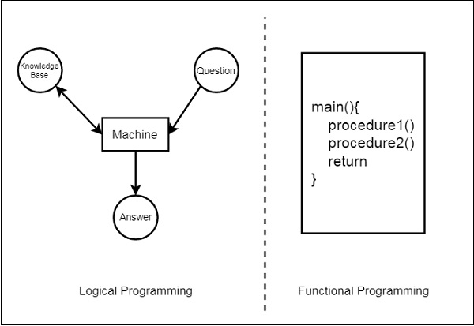
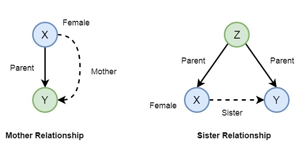

# Prolog
> Not very cool, but we have to do this to finish our graduation.

## Logical Programming

- The machine must access the knowledge base to, given an input, return an output
- Used in artificial intelligence where symbol manipulation and inference manipulation are the fundamental tasks

| Logical Programming | Functional Programming |
|-------------- | -------------- |
| Uses abstract models    | Follows Von-Neumann architecture | 
| Syntax is a sequence of statements | Syntax is the logic formulae (Horn Clauses) |
| Computes by deducting classes | Computes executing statements sequentially |

## Facts
- Is a predicate that is true. For example, "Tom is son of Sawyer"
- Facts can be defined as an explicit relationship between objects, and properties these objects might have.
- Facts are unconditionally true in nature. Examples:
    - Tom is a cat. ```cat(tom)```
    - Zoz is lazy. ```lazy(zoz)```
    - Hair is black. ```of_color(hair, black)```.`

## Rules
- Rules are extinctions of facts that contains conditional clauses
- Rules are **conditionally** trues. It is an **implicity** relatioship between objects.
- When one associated condition is true, then the predicate is also true
- Example: 
```
    grandfather(X, Y) :- father(X, Z), parent(Z, Y)
    happy(lili) :- dances(lili)
    hungry(tom) :- search_for_food(tom)
    friends(zoz, luiz) :- likes_dbz(zoz), likes_dbz(luiz)
```
> This implies that, for X be grandfather of Y, Z must be a parent (mother or father) of Y and X must be the father of Z


## Queries
- Queries are some questions on the relationships between objects and objects properties
- Is Tom a Cat?
- Does Zoz likes DBZ?

## Knowledge Bases
### Simple definition
```
    likes_dbz(zoz);
    likez_dbz(luiz);

    ?- likes_dbz(X);
    - zoz
    - luiz
```

### Conditionally
```
    likes_goku(zoz) :- likes_dbz(zoz) #only likes goku if he likes dbz
```

### More complex
```
    likes_dbz(luiz).

    likez(zoz, luiz) :- likes_dbz(luiz), likes_yamcha(luiz) #false, because luiz does not likes yamcha
```

## Relations in Prolog
- If we say "Amit has a bike", we are relationing Amit and Bike
- But we can ask, "Does Amit has a bike?"
```
    brother(X, Y) :- parent(Z, X), parent(Z, Y), male(X), male(Y)
```

## Prolog is basically a frontend to a tree
- When we define a relation between two objects, we are creting two nodes in a tree
- When we define a object propertie, we are defining a propertie to a specific node

